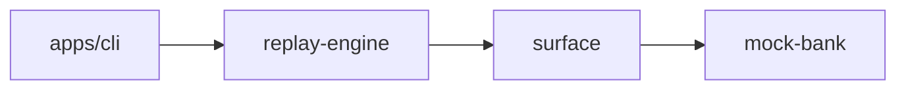
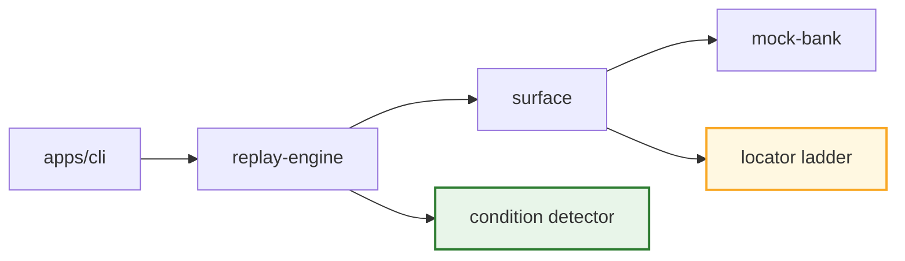
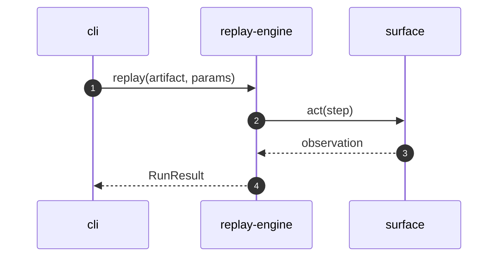

# <Feature Title>

> **Status:** Draft · **PoC:** <name> · **Branch:** `feature/<slug>` · **Requirements:** <R-IDs>
> Detail: [spec](./spec.md) · [plan](./plan.md)

## Why

<1–3 short sentences: the problem, and which part of the through-line it serves. No solution, no file paths.>

## Before → After

| Axis         | Before     | After      |
| ------------ | ---------- | ---------- |
| <Contract>   | <one line> | <one line> |
| <Execution>  | <one line> | <one line> |
| <Safety>     | <one line> | <one line> |

**Before**

**After**

## High Level Design

- **<Component>** — <one sentence: what it is and why it exists.>
- **<Decision>** — <one sentence: the trade-off taken (link the ADR).>
- **<Boundary>** — <one sentence: what it deliberately does not own.>

## Low Level Design

- **<path/to/file.ts>** — <one sentence: key export, type, or method.>
- **<seam or contract>** — <one sentence.>

## Impact

- **Touches:** <workspaces, comma separated>
- **Breaking:** <No, or the schema/contract break and for whom>
- **Deferred:** <what this explicitly does not do>
